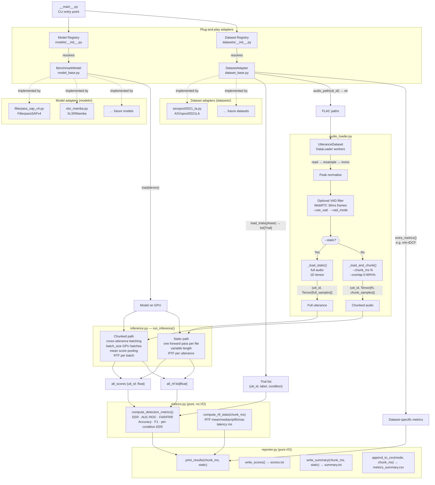
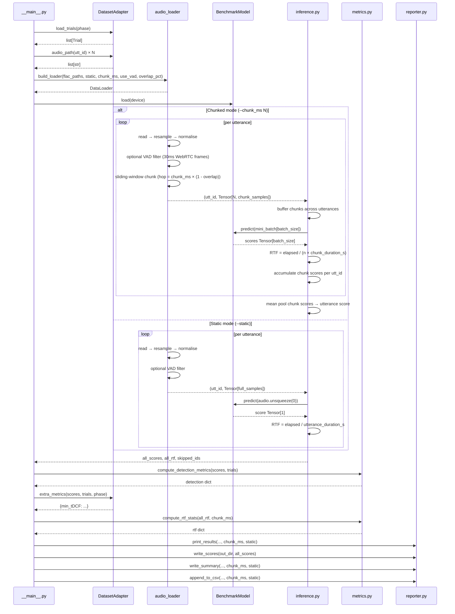

# Benchmarking Pipeline Architecture

## Overview

The benchmarking pipeline evaluates deepfake audio detection models against labelled datasets. It is designed around two independent plug-and-play axes: **models** and **datasets**. Any model can be evaluated against any dataset without touching shared infrastructure code.

---

## Design Decisions

### 1. Dual adapter pattern (Model + Dataset)

The central architectural decision is that both models and datasets are abstractions, not concrete implementations baked into the runner. Each is defined by an abstract base class and registered in a dictionary that the CLI resolves at runtime.

This was chosen because the research phase involves running multiple SOTA models (XLSR-Mamba, Fake-Mamba, Wav2Vec2-AASIST, etc.) against multiple datasets (ASVspoof 2021 LA, In-the-Wild, FoR, etc.). Without the adapter pattern, each new combination would require forking the runner script.

### 2. `BenchmarkModel` — three-method contract

The model adapter exposes only `load(device)`, `predict(chunks) -> tensor`, and `parameter_count()`. This is the minimum surface area needed to run timed inference. Anything model-specific (weight download, architecture args, repo path) stays inside the adapter and never leaks into the runner.

`predict()` returns a 1-D tensor of bonafide scores rather than raw logits or class probabilities — this normalises the output convention across models that use different output heads (softmax index 1, sigmoid, raw logit).

### 3. `DatasetAdapter` — trials + optional extra metrics

The dataset adapter owns three responsibilities:

- `load_trials(phase)` — returns a flat `list[Trial]` where each trial has `utt_id`, `label`, and `condition`.
- `audio_path(utt_id)` — isolates file-naming conventions (e.g. `.flac` extension, subdirectory layout) inside the adapter.
- `extra_metrics(scores, trials, phase)` — a hook for dataset-specific metrics. ASVspoof uses this for min-tDCF. Datasets without an equivalent inherit the default empty-dict implementation.

### 4. EER implemented natively in `metrics.py`

EER (FNR/FPR bisection) is implemented directly in `metrics.py` with no external dependencies. `eval_metrics` from the XLSR-Mamba repo is used only for min-tDCF via the ASVspoof adapter's `extra_metrics()` hook.

### 5. Two inference modes: chunked and static

The pipeline supports two mutually exclusive evaluation modes, toggled via CLI:

**Chunked mode** (`--chunk_ms N`, default 500):
- Audio is split into fixed-length non-overlapping windows of `N` milliseconds
- Chunks from multiple utterances are cross-buffered into `batch_size` GPU batches for efficiency
- Per-utterance score = mean bonafide score across all chunks (mean pooling)
- RTF = `inference_time / (n_chunks × chunk_duration_s)` per batch
- Directly emulates real-time streaming deployment

**Static mode** (`--static`):
- The full audio file is loaded without any chunking
- One forward pass per utterance; utterances are processed individually (variable length, no cross-utterance batching)
- RTF = `inference_time / utterance_duration_s` per utterance
- Matches the evaluation protocol used by published SOTA papers and Speech DF Arena leaderboard — use this for apples-to-apples EER comparisons against published numbers

The delta between static EER and chunked EER measures how much a model degrades under streaming conditions, which is itself a research finding.

### 6. Configurable chunk duration

Chunk size is controlled by `--chunk_ms` (default 500ms = 8000 samples at 16kHz). This propagates through the entire pipeline:

```
--chunk_ms → BenchmarkConfig.chunk_samples → build_loader() → UtteranceDataset
                                            → run_inference() → _flush() RTF
                                            → compute_rtf_stats() latency
                                            → reporter labels and CSV
```

The GPU warmup dummy tensor and RTF/latency calculations all use the configured chunk size, so measurements are always consistent with the actual inference unit.

### 7. VAD filtering and overlapping sliding window

Audio loading supports two orthogonal options:

- **VAD filtering** (`--use_vad`): WebRTC VAD runs on 30ms frames at 16 kHz. Non-speech frames are discarded before chunking. VAD aggressiveness is configurable via `--vad_mode` (0–3). VAD applies in both chunked and static modes.

- **Overlapping sliding window** (`--overlap`): Percentage of overlap between consecutive chunks in chunked mode. Default 0 = non-overlapping. `--overlap 80` gives 80% overlap (hop = 20% of chunk duration), useful for fine-grained temporal score aggregation at the cost of more forward passes per utterance.

Both options are wired through `BenchmarkConfig` → `build_loader()` → `UtteranceDataset` → worker functions, keeping the inference loop and metrics layer unaware of how chunks were produced.

### 8. `BenchmarkConfig` holds only inference execution state

Dataset paths (`eval_dir`, `keys_dir`) are constructor arguments to the dataset adapter. Model architecture args (`emb_size`, `num_encoders`) are constructor arguments to the model adapter. `BenchmarkConfig` holds only parameters that affect how inference is executed:

| Field | Default | Description |
|---|---|---|
| `out_dir` | — | Output directory |
| `phase` | `"eval"` | Dataset partition |
| `batch_size` | 32 | GPU mini-batch size (chunked mode) |
| `num_workers` | 8 | DataLoader worker processes |
| `static` | `False` | Full-utterance mode, no chunking |
| `chunk_ms` | 500 | Chunk duration in ms (chunked mode only) |
| `vad` | `False` | Enable WebRTC VAD silence filtering |
| `vad_mode` | 2 | VAD aggressiveness 0–3 |
| `overlap_pct` | 0 | Sliding window overlap percentage |

`chunk_samples` is a computed property: `int(TARGET_SR * chunk_ms / 1000)`.

### 9. `reporter.py` is pure I/O, reflects run configuration

The reporter receives fully-computed dicts from `metrics.py` and writes to stdout, `summary.txt`, and `metrics_summary.csv`. It is aware of `chunk_ms` and `static` so that RTF section headers, latency targets, and CSV rows accurately describe the configuration used. The CSV includes a `mode` column (`static` or `chunked_500ms`) and a `chunk_ms` column so runs at different configurations are distinguishable.

---

## Module Responsibilities

| Module | Responsibility |
|---|---|
| `model_base.py` | `BenchmarkModel` ABC — model plug-and-play contract |
| `dataset_base.py` | `DatasetAdapter` ABC + `Trial` dataclass — dataset plug-and-play contract |
| `models/__init__.py` | Model registry: CLI name → adapter class |
| `models/filterpass_sap.py` | Filterpass SAP adapter (loads from HuggingFace — legacy) |
| `models/filterpass_sap_v4.py` | Filterpass SAP v4 adapter (loads from local `checkpoints/best_model_SAP.pt`) |
| `models/xlsr_mamba.py` | XLSR-Mamba adapter (requires external repo checkout) |
| `datasets/__init__.py` | Dataset registry: CLI name → adapter class |
| `datasets/asvspoof2021_la.py` | ASVspoof 2021 LA adapter (CM keys, min-tDCF) |
| `config.py` | `BenchmarkConfig` (static, chunk_ms, VAD, overlap) + audio constants (`TARGET_SR`, `CHUNK_SAMPLES`) |
| `audio_loader.py` | `UtteranceDataset`, `_load_static`, `_load_and_chunk`, VAD filtering, sliding-window chunking, `build_loader()` |
| `inference.py` | Static and chunked inference loops, RTF timing, score aggregation |
| `metrics.py` | EER, AUC-ROC, FAR/FRR, classification metrics, `compute_rtf_stats(chunk_ms)` (pure, no I/O) |
| `reporter.py` | Console output, `scores.txt`, `summary.txt`, `metrics_summary.csv` (chunk-aware) |
| `__main__.py` | CLI entry point — wires all modules together |

---

## Pipeline Visualisation



---

## Data Flow Summary



---

## Sample Usage

### Chunked mode (streaming emulation)

```bash
# 500ms chunks — default, emulates real-time deployment
python -m scripts.benchmarking \
    --model      filterpass-sap-v4 \
    --dataset    asvspoof2021-la \
    --eval_dir   data/ASVspoof2021_LA_eval/flac \
    --keys_dir   data/keys/LA \
    --out_dir    results/ASVSpoof2021/filterpass-sap-v4 \
    --phase      eval \
    --batch_size 32 \
    --num_workers 8

# Custom chunk size
python -m scripts.benchmarking \
    --model filterpass-sap-v4 ... --chunk_ms 1000

# VAD-filtered chunking with 80% overlap
python -m scripts.benchmarking \
    --model xlsr-mamba ... --use_vad --vad_mode 2 --overlap 80
```

### Static mode (full-utterance, matches published EER)

```bash
# Evaluate on full utterances — comparable to Speech DF Arena / ASVspoof paper EERs
python -m scripts.benchmarking \
    --model      filterpass-sap-v4 \
    --dataset    asvspoof2021-la \
    --eval_dir   data/ASVspoof2021_LA_eval/flac \
    --keys_dir   data/keys/LA \
    --out_dir    results/ASVSpoof2021/filterpass-sap-v4-static \
    --phase      eval \
    --static
```

> **Note:** `--static` overrides `--chunk_ms`. The two flags are mutually exclusive — static mode processes each file as a single variable-length tensor with no chunking.

---

### Adding a new model

```python
# scripts/benchmarking/models/fake_mamba.py
import torch
from ..base.model_base import BenchmarkModel

class FakeMamba(BenchmarkModel):
    def __init__(self, repo_path: str):
        self._repo_path = repo_path
        self._model = None

    @property
    def name(self) -> str:
        return "Fake-Mamba"

    def load(self, device: torch.device) -> None:
        # download weights, build model, move to device
        ...
        self._model.eval()

    def predict(self, chunks: torch.Tensor) -> torch.Tensor:
        return self._model(chunks)[:, 1]   # bonafide score

    def parameter_count(self) -> int:
        return sum(p.numel() for p in self._model.parameters())
```

```python
# scripts/benchmarking/models/__init__.py  — add one line
from .fake_mamba import FakeMamba

REGISTRY: dict[str, type] = {
    "filterpass-sap":    FilterpassSAP,
    "filterpass-sap-v4": FilterpassSAPv4,
    "xlsr-mamba":        XLSRMamba,
    "fake-mamba":        FakeMamba,   # ← new
}
```

```bash
python -m scripts.benchmarking --model fake-mamba --dataset asvspoof2021-la \
    --repo_path /path/to/FakeMamba --eval_dir data/ASVspoof2021_LA_eval/flac ...
```

### Adding a new dataset

```python
# scripts/benchmarking/datasets/in_the_wild.py
import os
from ..base.dataset_base import DatasetAdapter, Trial

class InTheWild(DatasetAdapter):
    def __init__(self, eval_dir: str, keys_dir: str):
        self._eval_dir = eval_dir
        self._meta_csv = keys_dir   # path to metadata CSV

    @property
    def name(self) -> str:
        return "In-the-Wild"

    def load_trials(self, phase: str) -> list[Trial]:
        import pandas as pd
        df = pd.read_csv(self._meta_csv)
        return [
            Trial(utt_id=row.utt_id, label=row.label, condition=row.condition)
            for _, row in df.iterrows()
        ]

    def audio_path(self, utt_id: str) -> str:
        return os.path.join(self._eval_dir, utt_id + ".flac")

    # extra_metrics() not overridden → returns {} by default
```

```python
# scripts/benchmarking/datasets/__init__.py  — add one line
from .in_the_wild import InTheWild

REGISTRY: dict[str, type] = {
    "asvspoof2021-la": ASVspoof2021LA,
    "in-the-wild":      InTheWild,    # ← new
}
```

```bash
python -m scripts.benchmarking --model xlsr-mamba --dataset in-the-wild \
    --eval_dir data/in-the-wild/flac --keys_dir data/in-the-wild/meta.csv ...
```
