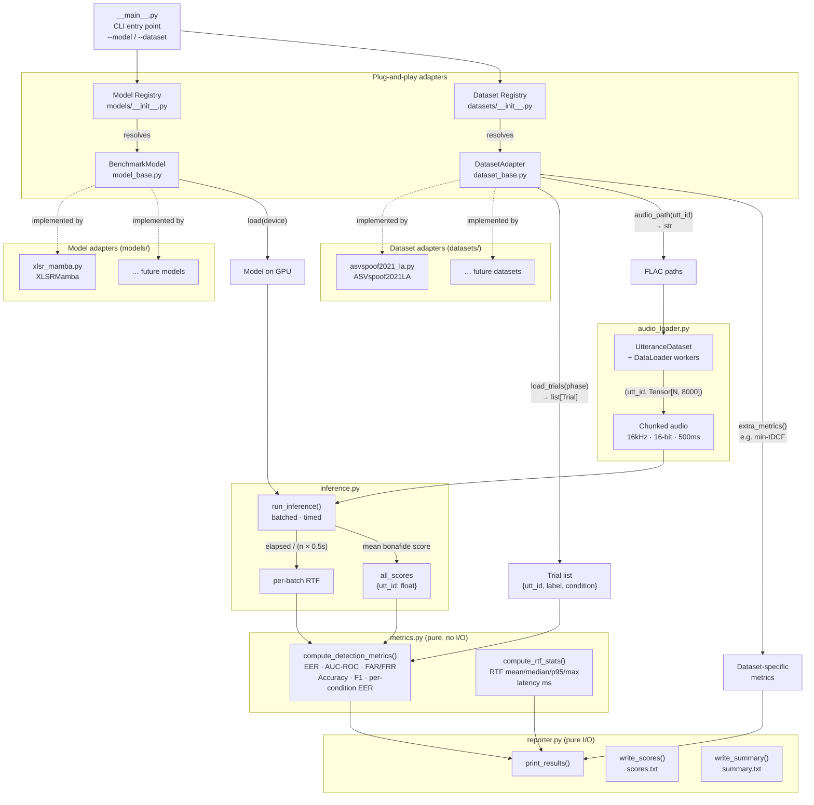
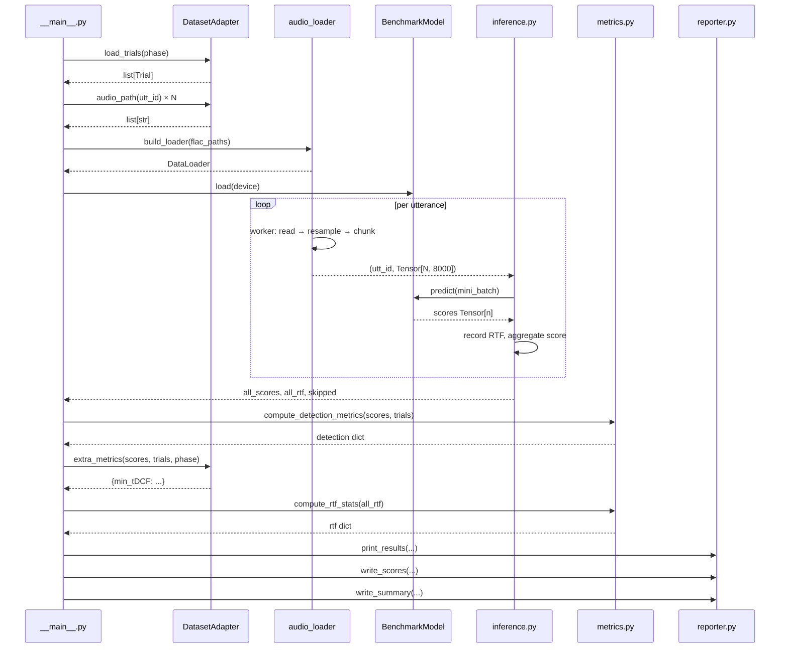

# Benchmarking Pipeline Architecture

## Overview

The benchmarking pipeline evaluates deepfake audio detection models against labelled datasets. It is designed around two independent plug-and-play axes: **models** and **datasets**. Any model can be evaluated against any dataset without touching shared infrastructure code.

---

## Design Decisions

### 1. Dual adapter pattern (Model + Dataset)

The central architectural decision is that both models and datasets are abstractions, not concrete implementations baked into the runner. Each is defined by an abstract base class and registered in a dictionary that the CLI resolves at runtime.

This was chosen because the research phase involves running multiple SOTA models (XLSR-Mamba, Fake-Mamba, Wav2Vec2-AASIST, etc.) against multiple datasets (ASVspoof 2021 LA, In-the-Wild, FoR, etc.). Without the adapter pattern, each new combination would require forking the runner script.

### 2. `BenchmarkModel` — three-method contract

The model adapter exposes only `load(device)`, `predict(chunks) -> tensor`, and `parameter_count()`. This is the minimum surface area needed to run timed inference. Anything model-specific (weight download, architecture args, repo path) stays inside the adapter and never leaks into the runner.

`predict()` is defined to return a 1-D tensor of bonafide scores rather than raw logits or class probabilities — this normalises the output convention across models that use different output heads (softmax index 1, sigmoid, raw logit).

### 3. `DatasetAdapter` — trials + optional extra metrics

The dataset adapter owns three responsibilities:

- `load_trials(phase)` — returns a flat `list[Trial]` where each trial has `utt_id`, `label`, and `condition`. Using a typed dataclass instead of a raw DataFrame with integer column indices removes the column-layout assumption that was previously hardcoded throughout the pipeline.
- `audio_path(utt_id)` — isolates file-naming conventions (e.g. `.flac` extension, subdirectory layout) inside the adapter.
- `extra_metrics(scores, trials, phase)` — a hook for dataset-specific metrics that have no universal definition. ASVspoof uses this for min-tDCF, which requires ASV speaker verification scores that only exist in that dataset. Datasets that do not have an equivalent simply inherit the default empty-dict implementation.

### 4. EER implemented natively in `metrics.py`

The original script imported `compute_eer` from the XLSR-Mamba repo's `eval_metrics.py`. This created an implicit dependency between the metrics layer and the model's external codebase. EER is a standard algorithm (FNR/FPR bisection) and has been reimplemented directly in `metrics.py` so the core metrics have zero external dependencies. `eval_metrics` is now only used for min-tDCF via the ASVspoof adapter's `extra_metrics()` hook.

### 5. `inference.py` is model-agnostic

The inference loop only depends on `BenchmarkModel`. It handles batching across the chunks of a single utterance, RTF timing (wall-clock elapsed / audio duration), and score aggregation (mean bonafide score across all chunks of an utterance). The RTF is measured per mini-batch rather than per utterance to get a stable distribution across the run.

### 6. Audio loading is parallelised in DataLoader workers

Each utterance is loaded, resampled (if needed), and split into fixed 500ms / 8000-sample chunks inside a DataLoader worker process. This runs on CPU in parallel while the GPU is busy with the previous batch. The fallback chain is `soundfile → torchaudio → skip`, so files with unusual encodings do not halt the run.

### 7. `BenchmarkConfig` holds only inference execution state

Dataset paths (`eval_dir`, `keys_dir`) are constructor arguments to the dataset adapter, not fields on `BenchmarkConfig`. Model architecture args (`emb_size`, `num_encoders`) are constructor arguments to the model adapter. `BenchmarkConfig` only holds parameters that affect how inference is executed: `out_dir`, `phase`, `batch_size`, `num_workers`.

### 8. `reporter.py` is pure I/O

The reporter receives fully-computed dicts from `metrics.py` and writes them to disk or stdout. It has no knowledge of how scores were produced, which model was used, or which dataset was evaluated. `dataset_name` and `model_name` are passed as plain strings from the adapters' `.name` properties.

---

## Module Responsibilities

| Module | Responsibility |
|---|---|
| `model_base.py` | `BenchmarkModel` ABC — model plug-and-play contract |
| `dataset_base.py` | `DatasetAdapter` ABC + `Trial` dataclass — dataset plug-and-play contract |
| `models/__init__.py` | Model registry: CLI name → adapter class |
| `models/xlsr_mamba.py` | XLSR-Mamba concrete adapter |
| `datasets/__init__.py` | Dataset registry: CLI name → adapter class |
| `datasets/asvspoof2021_la.py` | ASVspoof 2021 LA concrete adapter (CM keys, min-tDCF) |
| `config.py` | `BenchmarkConfig` + shared audio constants (`TARGET_SR`, `CHUNK_SAMPLES`) |
| `audio_loader.py` | `UtteranceDataset`, worker-based chunking, `build_loader()` |
| `inference.py` | Batched inference loop, RTF timing, score aggregation |
| `metrics.py` | EER, AUC-ROC, FAR/FRR, classification metrics, RTF stats (pure, no I/O) |
| `reporter.py` | Console output, `scores.txt`, `summary.txt` |
| `__main__.py` | CLI entry point — wires all modules together |

---

## Pipeline Visualisation



---

## Data Flow Summary



---

## Sample Usage

### CLI

```bash
# XLSR-Mamba on ASVspoof 2021 LA eval partition
python -m scripts.benchmarking \
    --model   xlsr-mamba \
    --dataset asvspoof2021-la \
    --eval_dir  data/ASVspoof2021_LA_eval/flac \
    --keys_dir  data/keys/LA \
    --out_dir   results/xlsr-mamba-asvspoof2021 \
    --phase     eval \
    --batch_size 32 \
    --num_workers 8

# Disable min-tDCF (no --keys_dir → adapter skips ASV error rates)
python -m scripts.benchmarking \
    --model   xlsr-mamba \
    --dataset asvspoof2021-la \
    --eval_dir data/ASVspoof2021_LA_eval/flac
```

### Adding a new model

```python
# scripts/benchmarking/models/fake_mamba.py
import torch
from ..model_base import BenchmarkModel

class FakeMamba(BenchmarkModel):
    def __init__(self, repo_path: str):
        self._repo_path = repo_path
        self._model = None

    @property
    def name(self) -> str:
        return "Fake-Mamba"

    def load(self, device: torch.device) -> None:
        # download weights, build model, move to device
        ...
        self._model.eval()

    def predict(self, chunks: torch.Tensor) -> torch.Tensor:
        return self._model(chunks)[:, 1]   # bonafide score

    def parameter_count(self) -> int:
        return sum(p.numel() for p in self._model.parameters())
```

```python
# scripts/benchmarking/models/__init__.py  — add one line
from .fake_mamba import FakeMamba

REGISTRY: dict[str, type] = {
    "xlsr-mamba": XLSRMamba,
    "fake-mamba":  FakeMamba,   # ← new
}
```

```bash
python -m scripts.benchmarking --model fake-mamba --dataset asvspoof2021-la \
    --repo_path /path/to/FakeMamba --eval_dir data/ASVspoof2021_LA_eval/flac ...
```

### Adding a new dataset

```python
# scripts/benchmarking/datasets/in_the_wild.py
import os
import pandas as pd
from ..dataset_base import DatasetAdapter, Trial

class InTheWild(DatasetAdapter):
    def __init__(self, eval_dir: str, meta_csv: str):
        self._eval_dir = eval_dir
        self._meta_csv = meta_csv   # columns: utt_id, label, condition

    @property
    def name(self) -> str:
        return "In-the-Wild"

    def load_trials(self, phase: str) -> list[Trial]:
        df = pd.read_csv(self._meta_csv)
        return [
            Trial(utt_id=row.utt_id, label=row.label, condition=row.condition)
            for _, row in df.iterrows()
        ]

    def audio_path(self, utt_id: str) -> str:
        return os.path.join(self._eval_dir, utt_id + ".flac")

    # extra_metrics() not overridden → returns {} by default
```

```python
# scripts/benchmarking/datasets/__init__.py  — add one line
from .in_the_wild import InTheWild

REGISTRY: dict[str, type] = {
    "asvspoof2021-la": ASVspoof2021LA,
    "in-the-wild":      InTheWild,    # ← new
}
```

```bash
python -m scripts.benchmarking --model xlsr-mamba --dataset in-the-wild \
    --eval_dir data/in-the-wild/flac --keys_dir data/in-the-wild/meta.csv ...
```
