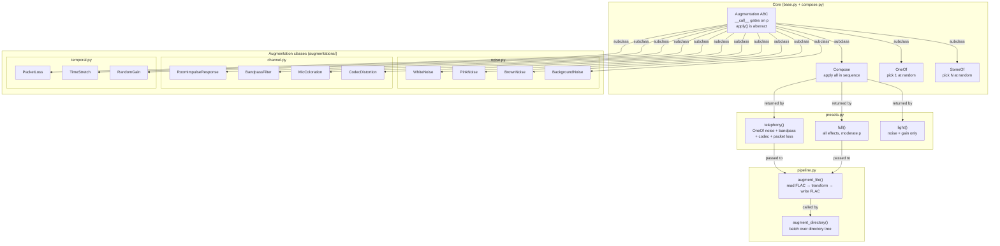
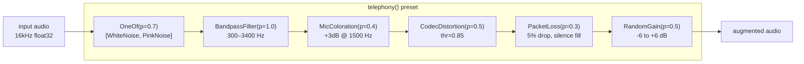

# Data Augmentation Pipeline Architecture

## Overview

The data augmentation pipeline generates realistic degraded audio for training deepfake detection models. It is built around a composable transform pattern (similar to `torchvision.transforms` and Keras `ImageDataGenerator`) where every augmentation is a callable class gated by a probability, and pipelines are assembled by nesting combinators.

A single call augments one audio array — no config file, no flags, no I/O:

```python
from scripts.data_augmentation import WhiteNoise
audio = WhiteNoise(snr_db=(15, 30), p=0.5)(audio, sr)
```

---

## Design Decisions

### 1. Callable classes with a probability gate

Every augmentation is a subclass of `Augmentation`. The base class handles the coin flip in `__call__`; the subclass only implements `apply(audio, sr) -> audio`. This means every augmentation can be used independently with a single function call, and the probability of application is set at construction time — not buried in a config flag.

This replaces the previous architecture where each augmentation was a module-level `augment()` function that read enable/disable flags from a monolithic `AugmentationConfig` dataclass. That design forced callers to construct a 20-field config object even to apply a single effect.

### 2. Uniform `(audio, sr)` signature

All augmentations accept and return `(np.ndarray, int)` regardless of whether they actually use the sample rate. The previous codebase had inconsistent signatures — some took `(audio, sr, cfg)`, others `(audio, cfg)` — which prevented generic composition. The uniform signature means any augmentation can slot into any combinator without adapter code.

### 3. Three combinators: Compose, OneOf, SomeOf

These are themselves `Augmentation` subclasses, so they nest arbitrarily:

- **`Compose`** — apply all transforms in sequence. Each child's own `p` decides whether it fires on this pass. This is the standard sequential pipeline.
- **`OneOf`** — pick exactly one child at random and apply it. Useful for mutually exclusive alternatives (e.g. pick one noise type).
- **`SomeOf`** — pick N children at random (without replacement) and apply them. N can be a fixed int or a `(min, max)` range. This is the "randomly apply a subset" behaviour the project needed.

Nesting means you can express complex policies declaratively:

```python
Compose([
    OneOf([WhiteNoise(), PinkNoise()]),       # one noise type
    SomeOf(n=(1, 2), transforms=[             # 1-2 channel effects
        BandpassFilter(), MicColoration(), CodecDistortion(),
    ]),
    RandomGain(p=0.5),                         # independent coin flip
])
```

### 4. Presets as factory functions

`presets.py` provides named factory functions (`telephony()`, `full()`, `light()`) that return ready-to-use `Compose` pipelines with tuned parameters and probabilities. This gives users a one-liner for common scenarios without limiting custom composition.

Presets are functions, not constants, because each call returns a fresh object tree. This avoids shared mutable state if the same preset is used in multiple threads or DataLoader workers.

### 5. File I/O is a separate layer

`pipeline.py` handles reading/writing FLAC files and stereo channel splitting. It accepts any `Augmentation` instance — it does not know which effects are inside. This separation means the transform logic can be used in-memory (training loop, live audio) without touching the filesystem.

### 6. No monolithic config

The previous `AugmentationConfig` dataclass had 20+ fields mixing concerns from all augmentation types. Each class now owns its own parameters (`snr_db`, `threshold`, `rate`, etc.) as constructor arguments with sensible defaults. Configuration is the pipeline tree itself — there is nothing to serialise beyond the code that constructs it.

---

## Module Responsibilities

| Module | Responsibility |
|---|---|
| `base.py` | `Augmentation` ABC — probability gate, `apply()` contract, `__repr__` |
| `compose.py` | `Compose`, `OneOf`, `SomeOf` — pipeline combinators |
| `utils.py` | `rms`, `mix_at_snr`, `match_length` — shared DSP helpers |
| `augmentations/noise.py` | `WhiteNoise`, `PinkNoise`, `BrownNoise`, `BackgroundNoise` |
| `augmentations/channel.py` | `RoomImpulseResponse`, `BandpassFilter`, `MicColoration`, `CodecDistortion` |
| `augmentations/temporal.py` | `PacketLoss`, `TimeStretch`, `RandomGain` |
| `presets.py` | `telephony()`, `full()`, `light()` — factory functions |
| `pipeline.py` | `augment_file()`, `augment_directory()` — FLAC I/O |
| `__main__.py` | CLI entry point (`--preset`, `--n-aug`, `--seed`) |

---

## Pipeline Visualisation



---

## Composition Model



Each node is an independent coin flip. On any given call, a different subset of effects will fire. For example, one pass might apply only `BandpassFilter` + `RandomGain`, while the next applies all six.

---

## Sample Usage

### Single augmentation

```python
import soundfile as sf
from scripts.data_augmentation import WhiteNoise

audio, sr = sf.read("utterance.flac", dtype="float32")
audio = WhiteNoise(snr_db=(15, 30), p=1.0)(audio, sr)
```

### Custom pipeline

```python
from scripts.data_augmentation import (
    Compose, OneOf, SomeOf,
    WhiteNoise, PinkNoise, BrownNoise,
    BandpassFilter, CodecDistortion, PacketLoss, RandomGain,
)

transform = Compose([
    OneOf([WhiteNoise(), PinkNoise(), BrownNoise()], p=0.7),
    BandpassFilter(low_hz=300, high_hz=3400, p=1.0),
    SomeOf(n=(1, 2), transforms=[
        CodecDistortion(threshold=0.85),
        PacketLoss(rate=0.05),
        RandomGain(db_range=(-6, 6)),
    ], p=0.6),
])

audio = transform(audio, sr)
```

### Using a preset

```python
from scripts.data_augmentation import telephony

transform = telephony()
audio = transform(audio, sr)
```

### File and directory augmentation

```python
from scripts.data_augmentation import full, augment_file, augment_directory

transform = full()

# Single file
augment_file("input.flac", "output.flac", transform, seed=42)

# Batch — 3 augmented copies per file
augment_directory("data/clean/", "data/augmented/", transform, n_augmentations=3)
```

### Inside a PyTorch DataLoader

```python
from torch.utils.data import Dataset
from scripts.data_augmentation import telephony

class AugmentedDataset(Dataset):
    def __init__(self, paths, sr=16000):
        self.paths = paths
        self.sr = sr
        self.transform = telephony()

    def __getitem__(self, idx):
        audio, sr = sf.read(self.paths[idx], dtype="float32")
        audio = self.transform(audio, sr)
        return torch.from_numpy(audio)
```

### CLI

```bash
# Telephony preset, 3 augmented copies per file
python -m scripts.data_augmentation data/clean/ data/augmented/ \
    --preset telephony --n-aug 3

# Full preset, single file
python -m scripts.data_augmentation input.flac output.flac --preset full --seed 42

# Light preset
python -m scripts.data_augmentation data/clean/ data/augmented/ --preset light
```

### Adding a new augmentation

```python
# scripts/data_augmentation/augmentations/temporal.py — add the class

class PitchShift(Augmentation):
    def __init__(self, semitone_range=(-2, 2), p=0.5):
        super().__init__(p=p)
        self.semitone_range = semitone_range

    def apply(self, audio, sr):
        import librosa
        semitones = random.uniform(*self.semitone_range)
        return librosa.effects.pitch_shift(audio, sr=sr, n_steps=semitones)
```

```python
# scripts/data_augmentation/augmentations/__init__.py — add one line
from .temporal import PacketLoss, TimeStretch, RandomGain, PitchShift
```

It is immediately usable in any pipeline:

```python
Compose([PitchShift(p=0.3), WhiteNoise(p=0.5)])
```
