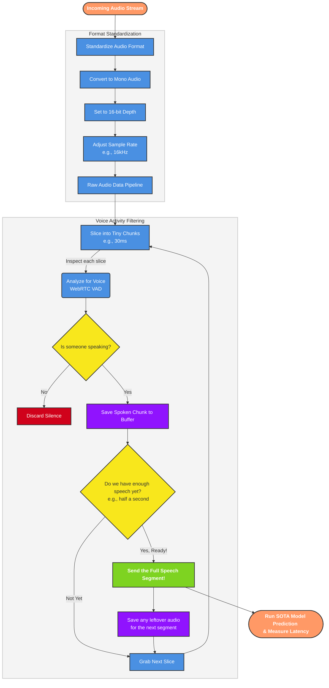

# Real-Time Audio Chunking Flowchart

This flowchart visualizes the continuous process of normalizing, extracting, and streaming valid voice chunks in real-time fashion, as defined in `audio_segmentation.py`.

