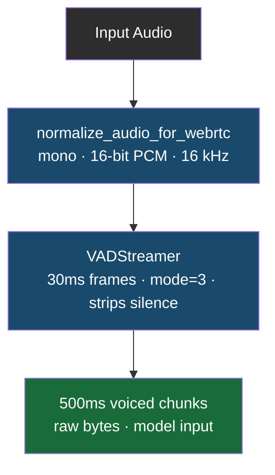
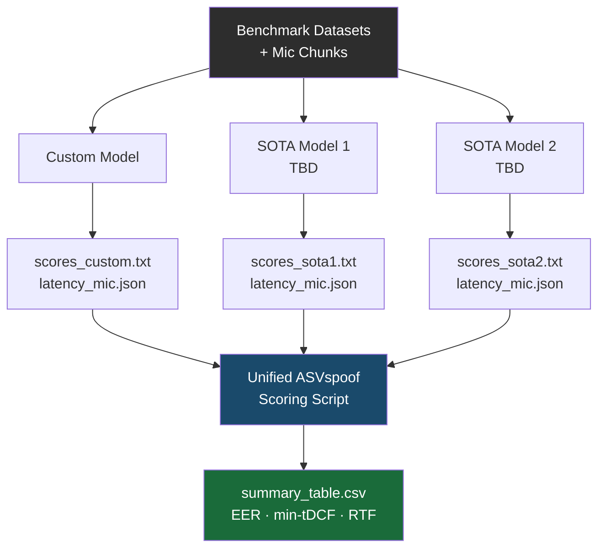

# Benchmarking Plan: SOTA Models with Real-Time Audio

## 1. Objective

Benchmark open-source SOTA deepfake detection models (sourced from HuggingFace) against our custom fine-tuned model, evaluated on two axes:

1. **Detection accuracy** — EER and min-tDCF across all benchmark datasets
2. **Real-time feasibility** — inference latency and RTF on live audio chunks

The scripts in `scripts/` form the audio ingestion layer for both axes. `audio_segmentation.py` feeds benchmark dataset files through VAD into fixed-size chunks; `microphone.py` replicates this for live mic input to measure end-to-end streaming latency.

---

## 2. Model Architecture

### 2.1 Our Custom Model (Fine-Tuned)

Our model is built by selecting one of the lightweight pre-trained architectures from `docs/models/model_comparison.md` and fine-tuning it on our training datasets (ASVspoof 2019 LA + WaveFake). The candidate base architectures are:

| Base Architecture | Params | Input | Rationale |
| :--- | :--- | :--- | :--- |
| **AASIST-L** | ~85k | Raw waveform | Primary candidate — best accuracy/latency tradeoff |
| **RawNet2** | ~1.4M | Raw waveform | Backup — simpler pipeline, strong 2019 baseline |
| **LCNN** | ~2M | LFCC/CQCC features | Only if committing to manual feature extraction |
| **Wav2Vec 2.0 Base** | ~95M | Raw waveform | Too heavy for real-time; ruled out for deployment |

The final choice of base architecture is documented in `docs/models/model_comparison.md`.

### 2.2 SOTA Competitors (HuggingFace, Inference-Only)

SOTA models are open-source models sourced directly from HuggingFace. They are run **inference-only** — no fine-tuning, no weight modification. The specific models are still under research and will be added here once identified, but the criteria for selection are:

- Highly cited in anti-spoofing / deepfake detection literature
- Publicly available pre-trained weights on HuggingFace
- Cover diverse backbone types (e.g., SSL-based, CNN-based, transformer-based)
- 3–4 models total to keep compute tractable

> **Note:** This section will be updated once the SOTA model shortlist is finalised.

---

## 3. Benchmark Datasets

Each model is evaluated on the following corpora (evaluation sets only):

| Dataset | Primary Stress |
| :--- | :--- |
| ASVspoof 2021 LA (C1–C7) | Codec artifacts, VoIP/PSTN degradation |
| ASVspoof 5 (2024) | Adversarial attacks, crowdsourced acoustics |
| SpeechFake (English BD) | 40 synthesis tools, linguistic diversity |
| In-the-Wild (English) | Social media compression, uncontrolled noise |
| CD-ADD (English) | Zero-shot TTS, cross-domain shift |
| ADD 2022/2023 (English) | Partial fakes, manipulation localization |
| CompSpoof (English 2025) | Compositional spoofing, low-artifact attacks |

---

## 4. Audio Ingestion Pipeline

All audio — whether from benchmark files or a live microphone — passes through the same VAD preprocessing before reaching any model:

**File-based** (benchmark datasets): `scripts/audio_segmentation.py` → `segment_audio(path)`
**Live mic**: `scripts/microphone.py` → `live_speech_stream()`

Both yield identical chunk format: 16 kHz, 16-bit mono PCM bytes, 500ms duration (16,000 samples).

---

## 5. Execution Protocol

### 5.1 Environment Isolation

Each SOTA competitor model runs in its own isolated Conda environment or Docker container to prevent PyTorch / torchaudio dependency conflicts. Our custom model runs in its own separate environment. Environments will be documented once the SOTA shortlist is finalised.

### 5.2 Micro-Benchmark Validation (Pre-Run)

Before running full sweeps, validate the pipeline on a small balanced subset (~200 files):

- Confirm chunk format matches each model's expected input
- Measure single forward-pass latency on local hardware
- Verify score output format before feeding into the unified scoring script

### 5.3 Full Dataset Run

For each model × dataset combination:

1. Run `segment_audio(path)` over all files in the evaluation partition
2. Pass each 500ms chunk through the model and record the raw probability score
3. Aggregate scores per utterance (mean pooling across chunks)
4. Write utterance-level scores to a `.txt` file in ASVspoof score format

### 5.4 Unified Scoring

All score files — from our custom model and all SOTA competitors — are fed into a **single ASVspoof evaluation script** to compute EER and min-tDCF. This ensures mathematically identical calculations across all models and baselines.

---

## 6. Real-Time Latency Benchmark

The latency test uses `microphone.py` as the harness. For each model:

1. Capture 100 consecutive voiced chunks from mic (500ms each)
2. Time the wall-clock duration of a single forward pass for each chunk
3. Record:
   - Mean latency (ms)
   - P95 latency (ms)
   - RTF = `inference_time / chunk_duration` (target: RTF < 0.1)
   - Peak memory usage (MB)

**Pass/fail threshold**: RTF < 0.1 (i.e., < 50ms to process a 500ms chunk). Models exceeding this cannot sustain real-time streaming.

---

## 7. Metrics Collected

| Metric | Category | Tool |
| :--- | :--- | :--- |
| EER | Anti-spoofing | ASVspoof eval script |
| min-tDCF | Anti-spoofing | ASVspoof eval script |
| AUC-ROC | Classification | `sklearn.metrics` |
| Accuracy / F1 | Classification | `sklearn.metrics` |
| Mean inference latency | Real-time | `time.perf_counter` |
| P95 latency | Real-time | `numpy.percentile` |
| RTF | Real-time | calculated |
| Peak memory (MB) | Real-time | `tracemalloc` / `psutil` |

---

## 8. Results Structure

---

## 9. Comparison Framework

Results are interpreted against two reference points:

- **Performance floor** — official dataset baselines (LFCC-LCNN for 2021, AASIST for 2024)
- **SOTA ceiling** — EER reported by the HuggingFace SOTA competitors on each dataset

The goal is to identify the specific datasets and acoustic conditions where our fine-tuned custom model outperforms the SOTA competitors, and to confirm it meets the RTF < 0.1 threshold for real-time deployment.
